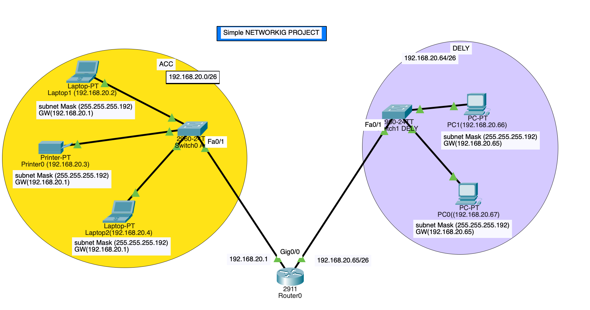

# Designing a Reliable Network for TechLogixxx: Connecting ACCOUNTS and DELIVERY:

In one of the suburbs of Tech City, there was a startup company called **"TechLogixxx"**, specializing in product shipping and delivery management. As the company’s business expanded, the IT department decided to improve the internal network infrastructure by designing a new network that connects the **ACCOUNTS** and **DELIVERY** departments.

The goal of this project was to ensure that employees in the ACCOUNTS department and the DELIVERY department could communicate smoothly through a reliable and fast network. A young network engineer sat down to draw up a comprehensive plan, taking into account the main requirements:

 - **Devices:** The engineer used a single router and two switches (one for each department), with two computers in each of the ACCOUNTS and DELIVERY departments.

 - **Network addresses:**
 The base network 192.168.20.0 was assigned, and it was divided as follows:

         ACCOUNTS: 192.168.20.0/26

         DELIVERY:192.168.20.64/26

 - **IP configuration:**
 Each device was given a suitable IP address and a default gateway connected to the router.

- **Connections:**
The appropriate cables (straight-through and crossover) were used to connect the computers to the switches and the router.
-  **Testing:**
The engineer ran **ping** tests to ensure that all devices could communicate with each other within the network.

And so, the project was successfully completed, and **TechLogixxx** now had a reliable network connecting its vital departments! 🚀✨

# Technologies Implemented

    - Creating a Simple Network using a Router and Access Layer Switch.
    - Connecting Networking devices with Correct cabling.
    - Connecting two Networks using a Router.
    - Subnetting and IP Addressing.
    - Assigning IP Addresses to Router's interfaces.
    - Static IP Address allocation to Host Devices.
    - Test and Verifying Network Communication.

