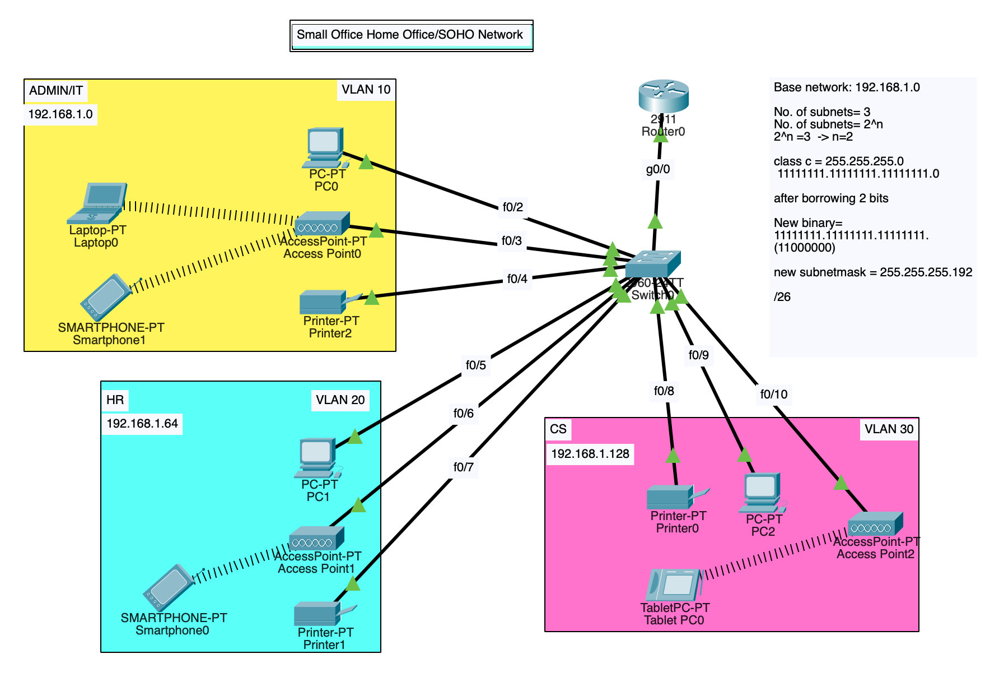

# Small Office Home Office Network

XYZ company is a fast-growing company in Eastern Australia with more than 2 million customers globally. 
The company deals with selling and buying of food items, 
which are basically operated from the headquarters. 
The company is intending to open a branch near the local village Bonalbo. Thus, the company 
requires young IT graduates to design the network for the branch. The network is intended to operate 
separately from the HQ network. Being a small network, 
the company has the following requirements during implementation;

    - One router and one switch to be used (all CISCO products).
    - 3 departments (Admin/IT, Finance/HR and Customer service/Reception).
    - Each department is required to be in different VIANS.
    - Each department is required to have a wireless network for the users.
    - Host devices in the network are required to obtain IPv4 address automatically.
    - Devices in all the departments are required to communicate with each other.

Assume the ISP gave out a base network of 192.168.1.0, 
you as the young network engineer who has been hired, design and implement a network considering the above requirements. 

# Technologies Implemented

    - Creating a Simple Network using a Router and Access Layer Switch.
    - Connecting Networking devices with Correct cabling.
    - Creating VLANs and assigning ports VLAN numbers.
    - Subnetting and IP Addressing.
    - Configuring Inter-VLAN Routing (Router on a stick).
    - Configuring DHCP Server (Router as the DHCP Server).
    - Configuring WLAN or wireless network (Cisco Access Point).
    - Host Device Configurations.
    - Test and Verifying Network Communication.
