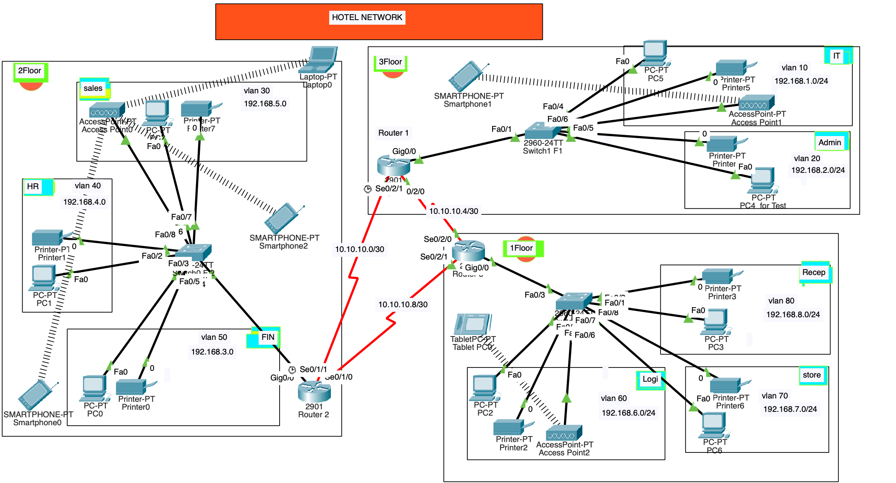

# Engel Hotel Network Project

This project designs and implements a secure network for Engel Hotel with three floors and multiple departments:

* **3 routers** in the IT server room, connected via Serial DCE cables (networks: 10.10.10.0/30, 10.10.10.4/30, 10.10.10.8/30).
* **One switch per floor**, managing VLANs for each department with unique IP subnets.
* Departments assigned VLANs from 10 to 80, e.g., IT (VLAN 10, 192.168.1.0/24), Reception (VLAN 80, 192.168.8.0/24).
* **OSPF** used for dynamic routing between routers.
* Routers act as **DHCP servers** for their VLANs.
* **SSH enabled** on all routers for secure remote access.
* Port security with **sticky MAC address** enabled on IT switch port fa0/1 for device Test-PC; unauthorized access shuts down the port.
  
 

# Technologies Implemented

    - Creating a network topology using Cisco Packet Tracer.
    - Hierarchical Network Design.
    - Connecting Networking devices with Correct cabling.
    - Creating VLANs and assigning ports VLAN numbers.
    - Subnetting and IP Addressing.
    - Configuring Inter-VLAN Routing (Router on a stick).
    - Configuring DHCP Server (Router as the DHCP Server).
    - Configuring SSH for secure Remote access.
    - Configuring switchport security or Port-Security on the switches.
    - Configuring WLAN or wireless network (Cisco Access Point).
    - Host Device Configurations.
    - Test and Verifying Network Communication.

A reliable, scalable, and secure network supporting all hotel departments efficiently.

---

# Packet Tracer Configuration

The Packet Tracer file (pr3.pkt) contains the complete network topology setup, including:
✅ VLAN configuration on switches
✅ Router-based DHCP server for dynamic IP assignment
✅ Inter-VLAN routing (Router-on-a-Stick)
✅ SSH configuration for secure remote access
✅ Switchport security on the switches
✅ WLAN setup with Cisco Access Points
✅ Host device configurations for network connectivity

This configuration ensures a reliable and secure network environment that effectively supports user requirements.
