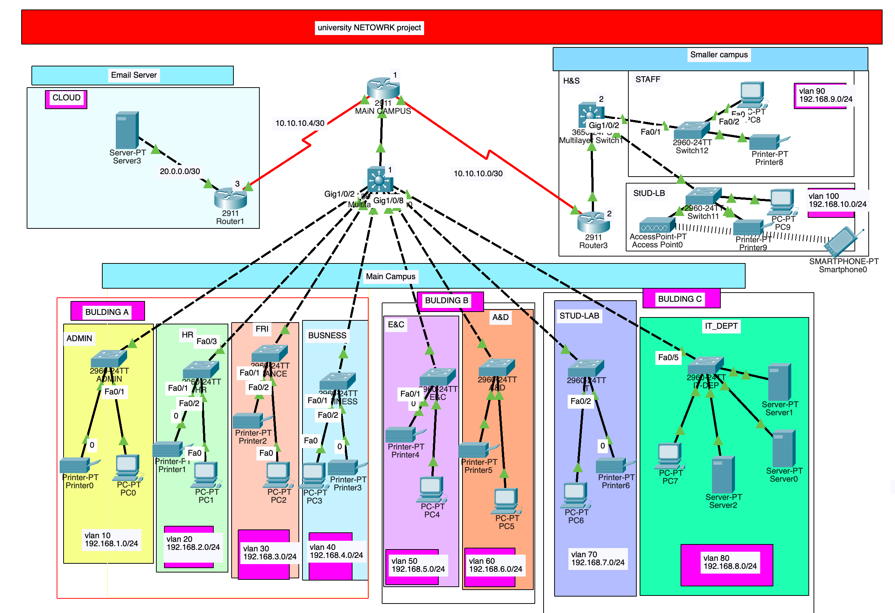

# Skyline University Network Design Project

This project implements a secure, scalable, and organized network topology for Albion University, which consists of two campuses located 20 miles apart.

## Network Overview

* **Main Campus**

  * **Building A**: Hosts the administrative departments (management, HR, finance) and the Faculty of Business. Each department is assigned its own VLAN to ensure data separation and security.
  * **Building B**: Hosts the Faculty of Engineering and Computing and the Faculty of Art and Design, each with its dedicated VLAN and subnet.
  * **Building C**: Contains students' labs and the IT department. The IT department hosts the university's internal servers, including the web server. The external email server is cloud-based.

* **Smaller Campus**

  * **Faculty of Health and Sciences**: Staff and student labs are on separate floors, each with its dedicated subnet and VLAN.
    
 
## Key Features

* **VLAN Segmentation**: Each department and faculty is assigned a separate VLAN and IP network to enhance security and organization.
* **Dynamic IP Allocation**: Devices in Building A acquire dynamic IP addresses from a router-based DHCP server.
* **RIPv2 Routing**: Internal routing across routers is achieved using RIPv2, while static routing is configured for the external email server in the cloud.
* **Security Configurations**: Switches are configured with VLAN security settings to prevent unauthorized access and promote network stability.

 # Technologies Implemented

    - Creating a network topology using Cisco Packet Tracer.
    - Hierarchical Network Design.
    - Connecting Networking devices with Correct cabling.
    - Creating VLANs and assigning ports VLAN numbers.
    - Subnetting and IP Addressing.
    - Configuring Inter-VLAN Routing (Router on a stick).
    - Configuring DHCP Server (Router as the DHCP Server).
    - Configuring SSH for secure Remote access.
    - Configuring RIPv2 as the routing protocol.
    - Configuring switchport security or Port-Security on the switches.
    - Host Device Configurations.
    - Test and Verifying Network Communication.

## Packet Tracer Configuration

The Packet Tracer file (`albion_university_network.pkt`) contains the full topology setup, including:
✅ VLAN configuration on switches
✅ Router-based DHCP server for Building A
✅ RIPv2 routing for internal communication
✅ Static routes for external email server
✅ PC and server configurations for testing connectivity

This ensures a reliable and secure network environment that supports the needs of staff and students at both campuses.

---

