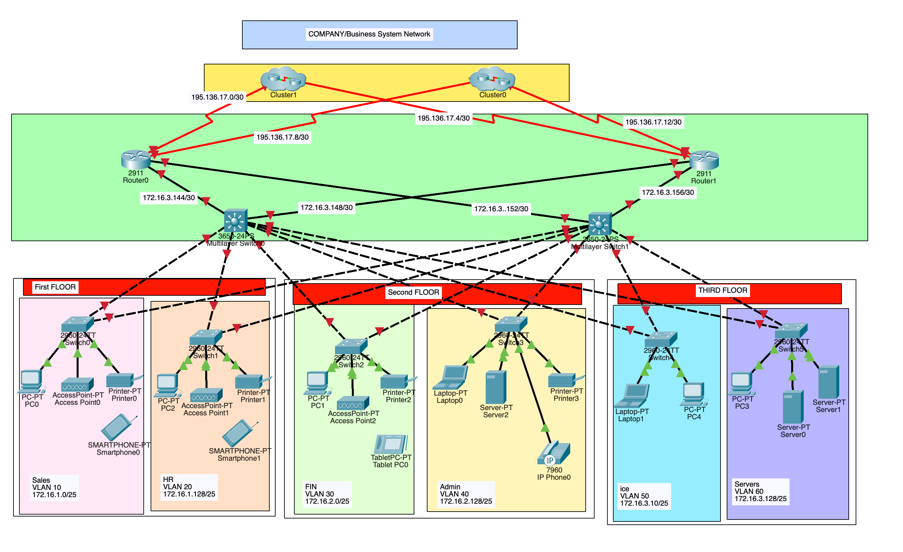

# Company & Business System Network

A trading floor support centre with 900 staff members is moving to a new building due to expansion. However, the new building currently lacks any network infrastructure. Before relocating, a new network must be designed and implemented from the ground up to ensure seamless operations.

The new building has three floors, each housing two departments:

First Floor: Sales and Marketing (120 users), Human Resources and Logistics (120 users)

Second Floor: Finance and Accounts (120 users), Administration and Public Relations (120 users)

Third Floor: ICT (120 users), Server Room (12 devices)

The network design must accommodate the current needs of all staff and be prepared for future expansion.

## CONFIG STEPS 
1. Basic settings to all devices plus ssh on the routers and l3 switches.
2. VLANs assignment plus all access and trunk ports on l2 and l3 switches.
3. Switchport security to finance department.
4. Subnetting and IP addressing
5. OSPF on the routers and l3 switches.
6. Static IP address to serverRoom devices.
7. DHCP server device configurations.
8. Inter-VLAN routing on the l3 switches plus ip dhcp helper addresses.
9. Wireless network configurations.
10. PAT + Access Control List
10.1.1. Default static route
11. Verifying and testing configurations.

## Technologies Implemented

✅ Network topology designed and implemented in **Cisco Packet Tracer**  
✅ **Hierarchical Network Design** for scalability and redundancy  
✅ **Correct cabling** and connection of network devices  
✅ **Basic device settings** (hostnames, console password, enable password, banners, disabled IP domain lookup)  
✅ **VLAN creation** and port assignment  
✅ **Subnetting and IP addressing** for all departments  
✅ **Inter-VLAN Routing** on multilayer switches (Switch Virtual Interfaces)  
✅ **Dedicated DHCP servers** for dynamic IP allocation to all devices (except server room devices with static IPs)  
✅ **OSPF** as the routing protocol on routers and multilayer switches  
✅ **SSH** configured on routers and multilayer switches for secure remote access  
✅ **NAT Overload (PAT)** for outbound traffic using router interface IPs  
✅ **ACLs** (standard and extended) for security and NAT functionality  
✅ **Switchport security** (Port-Security) for Finance and Accounts department:
  - Allows only one device per port
  - Sticky MAC address learning
  - Violation mode: shutdown

✅ **Wireless LANs (WLAN)** for each department using Cisco Access Points  
✅ **ISP router configuration** for Internet connectivity redundancy  
✅ **Host device configurations** for all user devices  
✅ **Full testing and verification** of network communication

## Final Network Topology

The complete network topology, including all departments, redundancy, routing, and security configurations, has been designed and implemented in Cisco Packet Tracer. All features have been thoroughly tested and verified to meet the user requirements.

### Resources

- **Packet Tracer file:** [Download here](#)  

