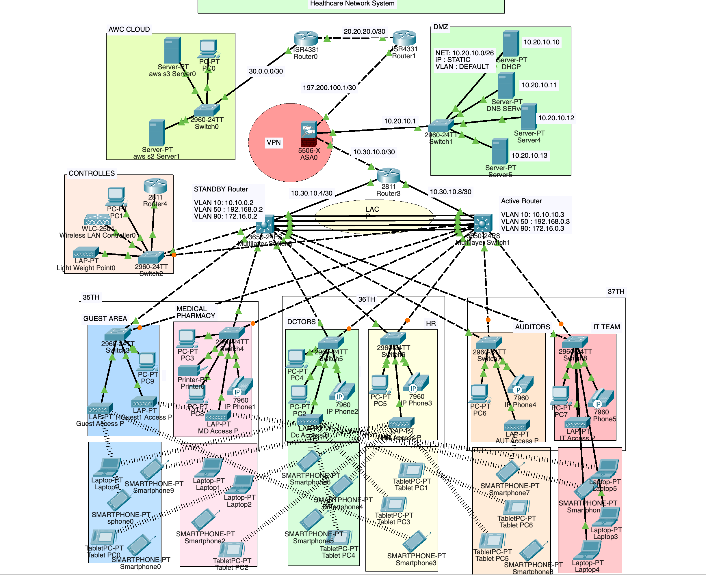

# Secure Healthcare Network System – Project #11

Dieses Projekt entwirft und implementiert ein sicheres, skalierbares und zuverlässiges Netzwerk für 
**Dr. Devi ShettyLabs Limited**, ein indisches Unternehmen im Gesundheitswesen.
Das Netzwerk basiert auf einem **hierarchischen Designmodell** und erfüllt Anforderungen an
**Verfügbarkeit, Redundanz, Skalierbarkeit und Sicherheit**.

## Hauptmerkmale

* **Standorte**: Drei Etagen (35.–37. Stock) mit über 2000 Benutzern
* **Netzwerksegmentierung**: LAN, WLAN und VoIP in separaten VLANs
* **Sicherheitsarchitektur**: Cisco ASA 5500-X Firewall mit Zonen und ACLs
* **Routing**: OSPF-Protokoll, Inter-VLAN-Routing, HSRP für Redundanz
* **Switching**: EtherChannel (LACP), STP PortFast & BPDUguard
* **DHCP/DNS/LDAP**: Bereitgestellt durch virtuelle Red Hat Directory Server auf ESXi
* **VoIP**: VoIP-Router und Cisco IP Phones mit Rufnummernformat (3...)
* **Wireless**: WLC-gesteuertes WLAN mit mehreren Lightweight Access Points
* **Cloud**: Anbindung an AWS für globale Servicebereitstellung

## IP-Adressbereiche

| Netzwerk | Adressbereich    | VLAN-ID |
| -------- | ---------------- | ------- |
| LAN      | 192.168.0.0/20   | 10      |
| WLAN     | 10.10.0.0/16     | 50      |
| Voice    | 172.16.0.0/20    | 99      |
| DMZ      | 10.20.20.0/26    | –       |
| Public   | 197.200.100.0/24 | –       |

## Technologien

* Cisco Packet Tracer Design
* Cisco Catalyst Switches & Router
* VMware ESXi Virtualisierung
* NetApp Storage
* ASA Firewall-Konfiguration (Security-Zones, NAT, ACLs)
* SSH-Zugriff nur für Senior Network Security Engineer (Standard ACL)
* Redundanz: HSRP, Failover-Server
* Skalierbarkeit für Benutzerwachstum bis 2025

## Ergebnis

Alle Konfigurationen wurden erfolgreich getestet. Die Netzwerkinfrastruktur ist sicher, 
redundant, performant und zukunftssicher.
